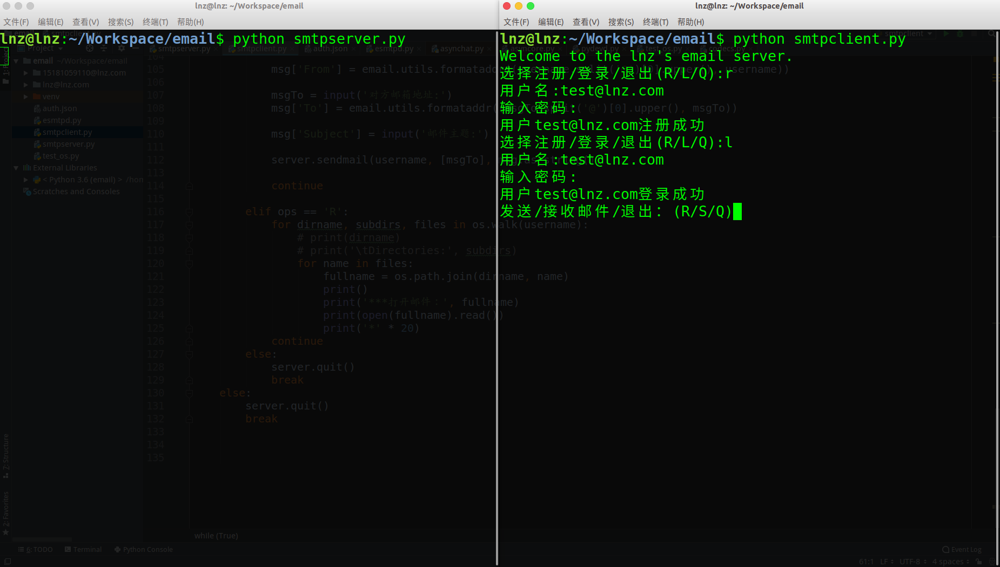
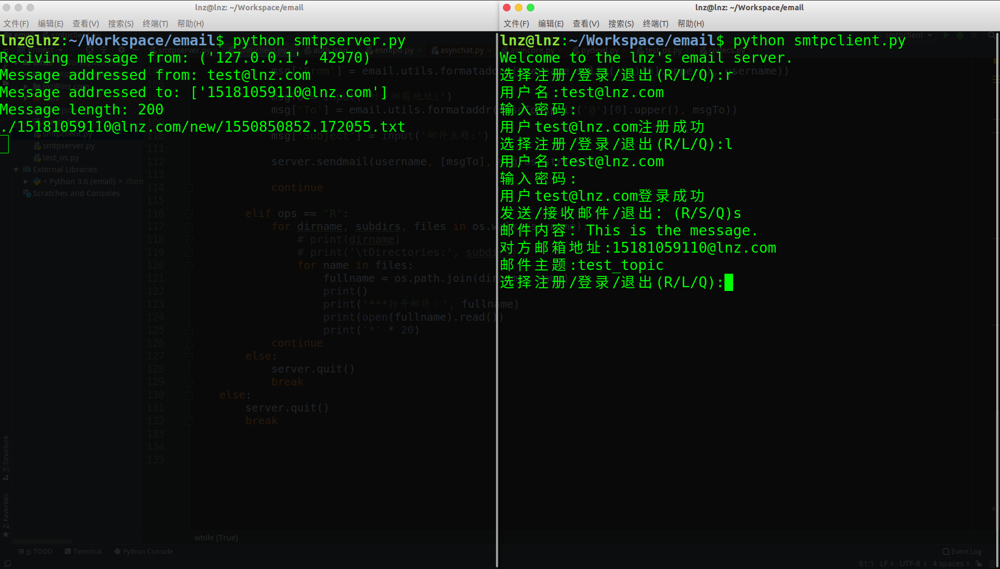
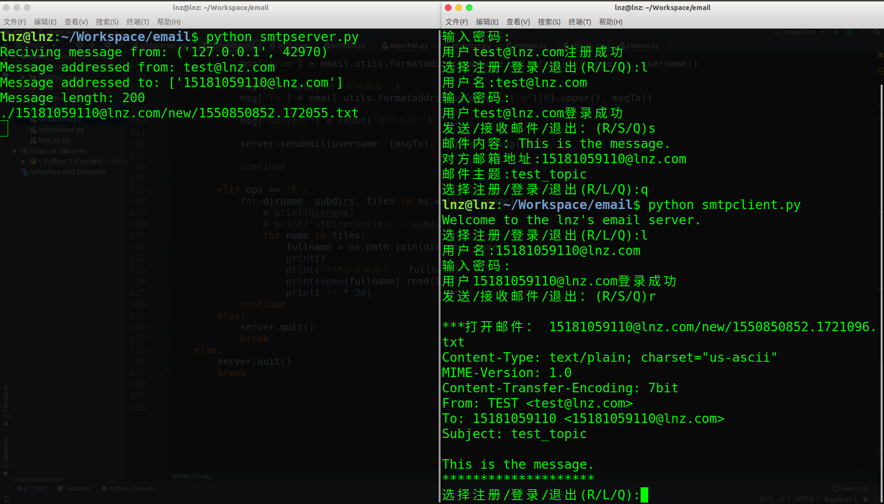

# Preliminary Extended SMTP Protocol
	Only for learning and communication. This is a proliminary engineering implementation, welcome to communicate with me.
## Motivation: finish my homework.

## Changed
1. I added REGI, USER, PSWD commands for registration, LOGINUSER and LOGINPASSWD commands for login in SMTP grammar. The final program can view and send mail locally.

## Test Screenshot
1. Register：
		
2. Login：
	
3. Send email:
	
4. Receive:
	
	
